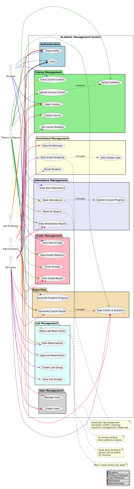
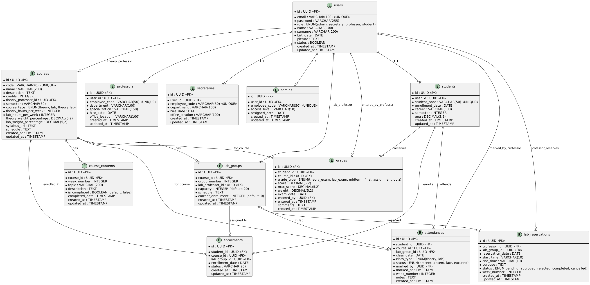
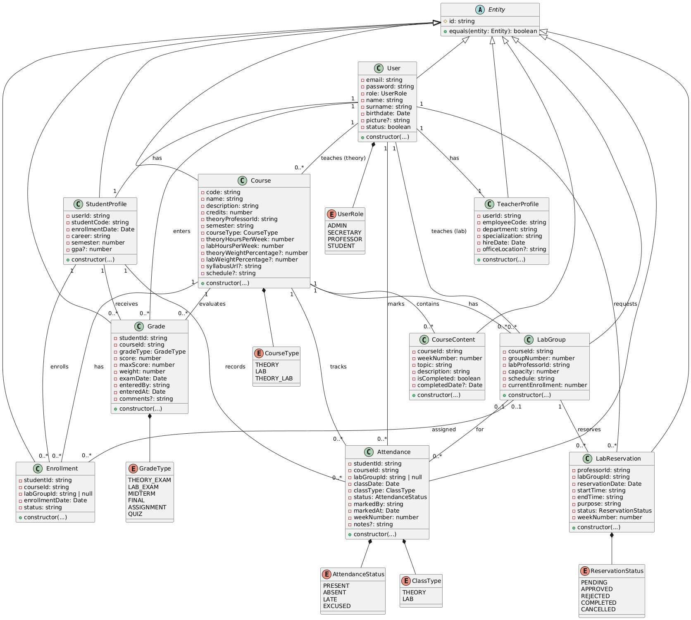

# 🎓 Academic Management System - Backend

> A comprehensive university academic management system built with **Clean Architecture**, **SOLID principles**, and modern backend technologies.

## 📋 Table of Contents

- [Overview](#overview)
- [Architecture & Design](#architecture--design)
- [System Diagrams](#system-diagrams)
- [Tech Stack](#tech-stack)
- [Features](#features)
- [Getting Started](#getting-started)
- [Project Structure](#project-structure)
- [API Documentation](#api-documentation)
- [Development Guidelines](#development-guidelines)

---

## 🎯 Overview

The Academic Management System is a **RESTful API** backend designed to manage all aspects of university operations, including course management, student enrollment, attendance tracking, grade management, and comprehensive reporting.

### Key Highlights

- ✅ **Clean Architecture** with clear separation of concerns
- ✅ **SOLID Principles** throughout the codebase
- ✅ **Type Safety** with TypeScript
- ✅ **Domain-Driven Design** approach
- ✅ **JWT Authentication** with role-based authorization
- ✅ **Comprehensive Testing** ready structure
- ✅ **Production-Ready** scalable architecture

---

## 🏗️ Architecture & Design

### Architectural Style

**RESTful API (Representational State Transfer)**
- Stateless client-server communication
- Resource-based URLs
- Standard HTTP methods (GET, POST, PUT, DELETE)
- JSON data format
- JWT token-based authentication

### Architectural Pattern

**Clean Architecture (Onion Architecture)**

The system follows Uncle Bob's Clean Architecture principles with four distinct layers:
```
┌─────────────────────────────────────────┐
│         Presentation Layer              │  ← Controllers, Routes, Middleware
├─────────────────────────────────────────┤
│         Application Layer               │  ← Use Cases, Services, DTOs
├─────────────────────────────────────────┤
│         Domain Layer (Core)             │  ← Entities, Business Rules
├─────────────────────────────────────────┤
│         Infrastructure Layer            │  ← Database, External Services
└─────────────────────────────────────────┘
```

**Key Principles:**
- Dependencies point inward (Dependency Rule)
- Domain layer has no external dependencies
- Infrastructure implements domain interfaces
- Business logic is framework-independent

### Design Patterns

| Pattern | Usage | Location |
|---------|-------|----------|
| **Repository Pattern** | Data access abstraction | `domain/repositories` |
| **Dependency Injection** | Loose coupling & testability | `DependencyContainer.ts` |
| **DTO Pattern** | Data transfer & validation | `application/dtos` |
| **Factory Pattern** | DTO creation & validation | DTO static `create()` methods |
| **Singleton Pattern** | Single service instances | `DependencyContainer` |
| **Middleware Pattern** | Request processing pipeline | `presentation/middlewares` |
| **Service Layer Pattern** | Business logic orchestration | `application/services` |

### Rendering Type

**CSR (Client-Side Rendering) - API Only**

This is a backend-only REST API designed to serve:
- Single Page Applications (React, Vue, Angular)
- Mobile applications (React Native, Flutter)
- Third-party integrations

No server-side rendering is implemented as this is a pure API backend.

### SOLID Principles

**Applied throughout the codebase:**

- **S - Single Responsibility Principle**
  - Each service handles one specific domain concern
  - Controllers only handle HTTP requests/responses
  - Entities contain only business logic

- **O - Open/Closed Principle**
  - Base Entity class is extensible
  - Repository interfaces allow multiple implementations
  - Middleware pipeline is extensible

- **L - Liskov Substitution Principle**
  - All entities extend base Entity class properly
  - Repository implementations are interchangeable
  - Services depend on interfaces, not implementations

- **I - Interface Segregation Principle**
  - Focused repository interfaces (IUserRepository, ICourseRepository)
  - Small, specific DTOs for each operation
  - Targeted service methods

- **D - Dependency Inversion Principle**
  - Services depend on repository interfaces
  - High-level modules don't depend on low-level modules
  - Infrastructure implements domain abstractions

### Clean Code Practices

- ✅ **Meaningful Names**: Descriptive variable and function names
- ✅ **Small Functions**: Each function does one thing well
- ✅ **DRY Principle**: No code duplication
- ✅ **Error Handling**: Centralized with AppError class
- ✅ **Comments**: Code is self-documenting
- ✅ **Formatting**: Consistent code style
- ✅ **Type Safety**: Full TypeScript coverage

---

## 📊 System Diagrams

### 1. Use Case Diagram

Shows all system actors and their interactions with the system.



**Key Use Cases:**
- **Students**: View content, grades, attendance, and personal progress
- **Professors**: Upload syllabus, manage attendance, enter grades, create lab reservations
- **Lab Professors**: Mark lab attendance, view grades (read-only)
- **Secretary**: Manage enrollments, create courses and lab groups, approve reservations
- **Administrator**: Full system access, user management, all reports

---

### 2. Entity Relationship Diagram (ERD)

Complete database schema showing all 12 tables and their relationships.



**Database Entities:**
- **users**: Base user table with role-based authentication
- **students, professors, secretaries, admins**: Role-specific profile tables
- **courses**: Course information with theory/lab configuration
- **lab_groups**: Lab sections with capacity management (20 students)
- **enrollments**: Student-course relationships with lab assignments
- **course_contents**: Weekly syllabus topics with completion tracking
- **attendances**: Theory and lab attendance records
- **grades**: Weighted grading system with multiple exam types
- **lab_reservations**: Professor lab booking system

---

### 3. Core Domain Class Diagram

Domain entities and their relationships (business logic layer).



**Domain Model:**
- **Base Entity**: Abstract class with ID and equality methods
- **Enums**: UserRole, CourseType, AttendanceStatus, GradeType, ReservationStatus
- **Entities**: User, StudentProfile, TeacherProfile, Course, LabGroup, Enrollment, CourseContent, Attendance, Grade, LabReservation
- **Relationships**: One-to-one, one-to-many, and optional associations

---

### 4. Package Diagram (Clean Architecture)

Layered architecture showing dependency flow and component organization.


**Architecture Layers:**
- **Presentation Layer**: Routes, Controllers, Middlewares (API interface)
- **Application Layer**: Services, DTOs (Use cases and orchestration)
- **Domain Layer**: Entities, Repository Interfaces (Core business logic)
- **Infrastructure Layer**: TypeORM, Database Config, External Services (Framework specifics)

**Dependency Rule**: All dependencies point inward toward the Domain layer.

---

## 🛠️ Tech Stack

### Core Technologies

| Technology | Version | Purpose |
|------------|---------|---------|
| **Node.js** | v18+ | JavaScript runtime environment |
| **TypeScript** | v5.3+ | Type-safe JavaScript |
| **Express.js** | v4.18+ | Web framework |
| **TypeORM** | v0.3+ | ORM for database operations |
| **PostgreSQL** | v13+ | Relational database |

### Security & Authentication

| Technology | Purpose |
|------------|---------|
| **JWT (jsonwebtoken)** | Stateless authentication |
| **Bcrypt** | Password hashing |
| **env-var** | Environment variable validation |

### Development Tools

| Tool | Purpose |
|------|---------|
| **tsx** | TypeScript execution & hot reload |
| **ESM** | ES Modules support |
| **Reflect Metadata** | Decorator support |

### Architecture & Patterns

- **Clean Architecture** (Onion Architecture)
- **Domain-Driven Design (DDD)**
- **Repository Pattern**
- **Dependency Injection**
- **DTO Pattern**
- **Middleware Pattern**
- **Service Layer Pattern**

---

## ✨ Features

### 🔐 Authentication & Authorization
- JWT-based authentication
- Role-based access control (RBAC)
- Password hashing with bcrypt
- Token expiration management

### 👥 User Management
- Multi-role support (Admin, Secretary, Professor, Student)
- User profiles with role-specific data
- User status management

### 📚 Course Management
- Course creation and configuration
- Syllabus upload (PDF)
- Course content management (weekly topics)
- Theory/Lab weight configuration
- Course type support (Theory, Lab, Theory+Lab)

### 🧪 Lab Management
- Lab group creation (capacity: 20 students)
- Automatic lab assignment
- Lab professor assignment
- Lab reservation system (max 2 per week)
- Reservation approval workflow

### 📝 Enrollment System
- Single student enrollment
- Bulk enrollment with auto lab assignment
- Schedule conflict detection
- Lab capacity management
- Enrollment status tracking

### ✅ Attendance Tracking
- Mark attendance (15-minute window)
- Automatic absent marking
- Theory and lab attendance separation
- Weekly attendance tracking
- Automatic course progress updates

### 📊 Grade Management
- Weighted grading system
- Multiple grade types (Midterm, Final, Quiz, Assignment)
- Grade entry by theory professors
- Automatic grade calculations
- Grade statistics

### 📈 Reporting & Analytics
- Comprehensive course reports
- Student progress tracking
- Attendance distribution (chart-ready data)
- Grade distribution (chart-ready data)
- Performance analytics
- Export-ready JSON format

---

## 🚀 Getting Started

### Prerequisites

- Node.js v18 or higher
- PostgreSQL v13 or higher
- npm or yarn

### Installation

1. **Clone the repository**
```bash
   git clone <repository-url>
   cd academic-management-system
```

2. **Install dependencies**
```bash
   npm install
```

3. **Configure environment**
```bash
   cp .env.example .env
```
   
   Edit `.env` with your configuration:
```env
   APP_PORT=3000
   DB_HOST=localhost
   DB_PORT=5432
   DB_USERNAME=postgres
   DB_PASSWORD=your_password
   DB_NAME=academic_db
   JWT_SECRET=your_super_secret_key
```

4. **Create database**
```bash
   createdb academic_db
```

5. **Seed admin user**
```bash
   npm run seed:admin
```
   
   Default credentials:
   - Email: `admin@university.edu`
   - Password: `admin123`

6. **Start the server**
```bash
   # Development mode
   npm run dev
   
   # Production mode
   npm run build && npm start
```

### Verification

Server should start on `http://localhost:3000`

Test with:
```bash
curl http://localhost:3000/api/auth/login \
  -H "Content-Type: application/json" \
  -d '{"email":"admin@university.edu","password":"admin123"}'
```

---

## 📁 Project Structure
```
src/
├── domain/                     # Domain Layer (Core Business Logic)
│   ├── entities/              # Domain entities
│   │   ├── base/
│   │   │   └── Entity.ts     # Base entity class
│   │   ├── User.ts
│   │   ├── Course.ts
│   │   ├── Attendance.ts
│   │   ├── Grade.ts
│   │   ├── Enrollment.ts
│   │   ├── LabGroup.ts
│   │   ├── LabReservation.ts
│   │   └── CourseContent.ts
│   └── repositories/          # Repository interfaces
│       ├── IUserRepository.ts
│       └── ICourseRepository.ts
│
├── application/               # Application Layer (Use Cases)
│   ├── dtos/                 # Data Transfer Objects
│   │   ├── LoginDTO.ts
│   │   ├── CreateUserDTO.ts
│   │   ├── CourseDTO.ts
│   │   ├── AttendanceDTO.ts
│   │   ├── GradeDTO.ts
│   │   ├── EnrollmentDTO.ts
│   │   ├── CourseContentDTO.ts
│   │   └── LabReservationDTO.ts
│   └── services/             # Application services
│       ├── AuthenticationService.ts
│       ├── UserService.ts
│       ├── CourseService.ts
│       ├── CourseContentService.ts
│       ├── AttendanceService.ts
│       ├── GradeService.ts
│       ├── EnrollmentService.ts
│       ├── LabGroupService.ts
│       ├── LabReservationService.ts
│       └── ReportService.ts
│
├── infrastructure/            # Infrastructure Layer (External Concerns)
│   ├── postgres/
│   │   ├── config/
│   │   │   └── database.config.ts
│   │   ├── entities/         # TypeORM entities (12 tables)
│   │   │   ├── UserEntity.ts
│   │   │   ├── StudentEntity.ts
│   │   │   ├── ProfessorEntity.ts
│   │   │   ├── SecretaryEntity.ts
│   │   │   ├── AdminEntity.ts
│   │   │   ├── CourseEntity.ts
│   │   │   ├── LabGroupEntity.ts
│   │   │   ├── EnrollmentEntity.ts
│   │   │   ├── CourseContentEntity.ts
│   │   │   ├── AttendanceEntity.ts
│   │   │   ├── GradeEntity.ts
│   │   │   └── LabReservationEntity.ts
│   │   └── repositories/     # Repository implementations
│   │       └── UserRepository.ts
│   ├── other/
│   │   ├── JWTService.ts
│   │   └── PasswordHasher.ts
│   └── DependencyContainer.ts
│
├── presentation/              # Presentation Layer (API)
│   ├── middlewares/
│   │   ├── authMiddleware.ts
│   │   └── errorHandler.ts
│   ├── auth/
│   │   ├── auth.controller.ts
│   │   └── route.ts
│   ├── course/
│   │   ├── course.controller.ts
│   │   └── route.ts
│   ├── attendance/
│   │   ├── attendance.controller.ts
│   │   └── route.ts
│   ├── grade/
│   │   ├── grade.controller.ts
│   │   └── route.ts
│   ├── enrollment/
│   │   ├── enrollment.controller.ts
│   │   └── route.ts
│   ├── lab/
│   │   ├── lab.controller.ts
│   │   └── route.ts
│   ├── report/
│   │   ├── report.controller.ts
│   │   └── route.ts
│   ├── student/
│   │   ├── student.controller.ts
│   │   └── route.ts
│   ├── professor/
│   │   ├── professor.controller.ts
│   │   └── route.ts
│   ├── routes.ts             # Main routes aggregator
│   └── server.ts             # Express server setup
│
├── shared/                    # Shared utilities
│   ├── errors/
│   │   └── AppError.ts
│   └── utils/
│       └── Logger.ts
│
├── config/                    # Configuration
│   ├── env.ts
│   └── index.ts
│
└── index.ts                   # Application entry point
```

---

## 📖 API Documentation

### Base URL
```
http://localhost:3000/api
```

### Authentication

All protected endpoints require JWT token:
```bash
Authorization: Bearer <your_jwt_token>
```

### Complete API Endpoints

#### 🔐 Authentication

| Method | Endpoint | Description | Access |
|--------|----------|-------------|--------|
| POST | `/auth/login` | User login | Public |
| GET | `/auth/profile` | Get current user profile | Authenticated |

#### 📚 Courses

| Method | Endpoint | Description | Access |
|--------|----------|-------------|--------|
| POST | `/courses` | Create new course | Admin, Secretary |
| GET | `/courses` | Get all courses | Authenticated |
| GET | `/courses/:id` | Get course by ID | Authenticated |
| GET | `/courses/professor/my-courses` | Get professor's courses | Professor |
| POST | `/courses/syllabus` | Upload course syllabus (PDF) | Professor |
| POST | `/courses/content` | Upload course content (weekly topics) | Professor |
| GET | `/courses/:courseId/content` | Get course content and progress | Authenticated |
| PUT | `/courses/:courseId/weights` | Update course weight percentages | Secretary |

#### ✅ Attendance

| Method | Endpoint | Description | Access |
|--------|----------|-------------|--------|
| POST | `/attendance` | Mark attendance (bulk) | Professor |
| POST | `/attendance/mark-absent` | Mark all students absent | Professor |
| GET | `/attendance/student/:studentId/course/:courseId` | Get student attendance | Authenticated |
| GET | `/attendance/course/:courseId/report` | Get course attendance report | Professor, Admin, Secretary |

#### 📊 Grades

| Method | Endpoint | Description | Access |
|--------|----------|-------------|--------|
| POST | `/grades` | Enter grade for student | Professor |
| GET | `/grades/student/:studentId/course/:courseId` | Get student grades | Authenticated |
| GET | `/grades/course/:courseId/report` | Get course grades report | Professor, Admin, Secretary |
| GET | `/grades/course/:courseId/statistics` | Get grade statistics | Professor, Admin, Secretary |

#### 📝 Enrollments

| Method | Endpoint | Description | Access |
|--------|----------|-------------|--------|
| POST | `/enrollments` | Enroll single student | Secretary |
| POST | `/enrollments/bulk` | Bulk enroll students (auto lab assignment) | Secretary |
| GET | `/enrollments/student/:studentId` | Get student enrollments | Authenticated |
| GET | `/enrollments/course/:courseId` | Get course enrollments | Authenticated |

#### 🧪 Lab Management

| Method | Endpoint | Description | Access |
|--------|----------|-------------|--------|
| POST | `/labs/groups` | Create lab group | Secretary |
| GET | `/labs/groups/course/:courseId` | Get lab groups for course | Authenticated |
| GET | `/labs/groups/my-groups` | Get professor's lab groups | Professor |
| POST | `/labs/reservations` | Create lab reservation | Professor |
| GET | `/labs/reservations/my-reservations` | Get professor's reservations | Professor |
| GET | `/labs/reservations` | Get all reservations | Admin, Secretary |
| PUT | `/labs/reservations/:reservationId/approve` | Approve reservation | Secretary |
| PUT | `/labs/reservations/:reservationId/reject` | Reject reservation | Secretary |
| PUT | `/labs/reservations/:reservationId/cancel` | Cancel reservation | Professor |

#### 📈 Reports

| Method | Endpoint | Description | Access |
|--------|----------|-------------|--------|
| GET | `/reports/course/:courseId` | Generate comprehensive course report | Professor, Admin, Secretary |
| GET | `/reports/student/:studentId/course/:courseId` | Generate student progress report | Authenticated |

#### 👥 Students

| Method | Endpoint | Description | Access |
|--------|----------|-------------|--------|
| POST | `/students` | Create student | Admin, Secretary |
| GET | `/students` | Get all students | Authenticated |
| GET | `/students/:id` | Get student by ID | Authenticated |

#### 👨‍🏫 Professors

| Method | Endpoint | Description | Access |
|--------|----------|-------------|--------|
| POST | `/professors` | Create professor | Admin, Secretary |
| GET | `/professors` | Get all professors | Authenticated |
| GET | `/professors/:id` | Get professor by ID | Authenticated |

### Example Requests

#### Login
```bash
curl -X POST http://localhost:3000/api/auth/login \
  -H "Content-Type: application/json" \
  -d '{
    "email": "professor@university.edu",
    "password": "password123"
  }'
```

#### Mark Attendance
```bash
curl -X POST http://localhost:3000/api/attendance \
  -H "Content-Type: application/json" \
  -H "Authorization: Bearer YOUR_TOKEN" \
  -d '{
    "courseId": "course-uuid",
    "classDate": "2024-10-20",
    "classType": "theory",
    "weekNumber": 5,
    "attendances": [
      {"studentId": "student1-uuid", "status": "present"},
      {"studentId": "student2-uuid", "status": "absent"}
    ]
  }'
```

#### Bulk Enrollment
```bash
curl -X POST http://localhost:3000/api/enrollments/bulk \
  -H "Content-Type: application/json" \
  -H "Authorization: Bearer YOUR_TOKEN" \
  -d '{
    "courseId": "course-uuid",
    "studentIds": ["uuid1", "uuid2", "uuid3"],
    "autoAssignLabs": true
  }'
```

#### Generate Course Report
```bash
curl -X GET http://localhost:3000/api/reports/course/course-uuid \
  -H "Authorization: Bearer YOUR_TOKEN"
```

### 📄 Full API Documentation

For detailed request/response schemas, validation rules, and advanced examples:

**[View Complete API Documentation →](https://uams-api-docs.com)**


---

## 💻 Development Guidelines

### Code Style

- Use **TypeScript** for all code
- Follow **Clean Code** principles
- Apply **SOLID** principles
- Use **meaningful names** for variables and functions
- Keep functions **small and focused**
- Write **self-documenting code**

### Dependency Rule
```
Presentation → Application → Domain ← Infrastructure
```

**Never violate this rule:**
- Domain should have no dependencies
- Application depends only on Domain
- Infrastructure implements Domain interfaces
- Presentation depends on Application

### Adding New Features

1. **Start with Domain**
   - Create entity in `domain/entities/`
   - Define repository interface in `domain/repositories/`

2. **Add Application Logic**
   - Create DTO in `application/dtos/`
   - Create service in `application/services/`

3. **Implement Infrastructure**
   - Create TypeORM entity in `infrastructure/postgres/entities/`
   - Implement repository in `infrastructure/postgres/repositories/`

4. **Add Presentation**
   - Create controller in `presentation/{feature}/`
   - Create routes in `presentation/{feature}/route.ts`
   - Add to `DependencyContainer.ts`

### Testing
```bash
# Run tests (when implemented)
npm test

# Run tests with coverage
npm run test:coverage
```

### Database Migrations

For production, disable `synchronize` in `database.config.ts`:
```typescript
synchronize: false  // IMPORTANT: Set to false in production
```

Then use TypeORM migrations:
```bash
npm run migration:generate -- -n MigrationName
npm run migration:run
```

---

## 🔒 Security Considerations

- ✅ All passwords hashed with bcrypt (10 rounds)
- ✅ JWT tokens expire after 24 hours
- ✅ Role-based authorization on all endpoints
- ✅ Input validation with DTOs
- ✅ SQL injection prevention (TypeORM parameterized queries)
- ✅ Environment variables for sensitive data
- ✅ CORS enabled (configure for production)
- ✅ Centralized error handling
- ✅ No sensitive data in logs

**Production Checklist:**
- [ ] Change JWT_SECRET to strong random string (min 64 characters)
- [ ] Enable HTTPS/TLS
- [ ] Set up rate limiting (e.g., express-rate-limit)
- [ ] Configure CORS with specific origins
- [ ] Set `synchronize: false` in TypeORM
- [ ] Use migrations for schema changes
- [ ] Enable structured logging
- [ ] Set up monitoring (e.g., Prometheus, Grafana)
- [ ] Implement request logging
- [ ] Add helmet.js for security headers
- [ ] Set up backup strategy
- [ ] Configure database connection pooling

---

## 📊 Performance Considerations

- **Database Indexes**: Critical foreign keys are indexed
- **Connection Pooling**: TypeORM manages connection pool
- **Query Optimization**: Use select specific fields when needed
- **Pagination**: Implement for large data sets (future enhancement)
- **Caching**: Consider Redis for frequently accessed data (future enhancement)

---
